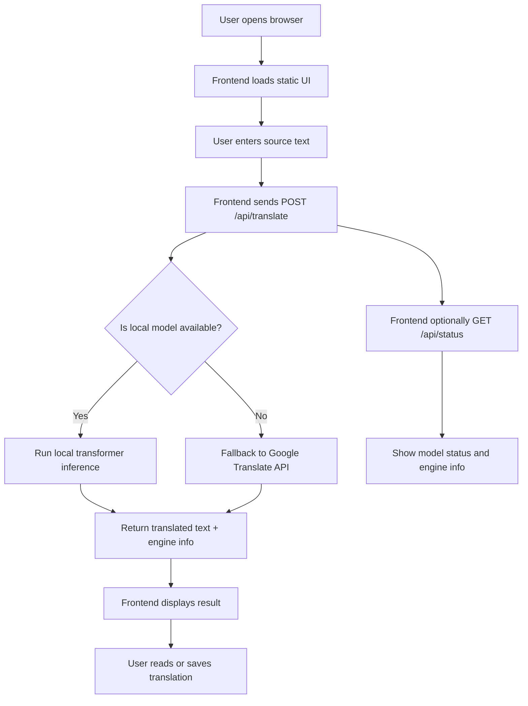

# Translator

[](LICENSE) [](https://github.com/Satishkumargangavarapu/Translator)

A multilingual translator web application built with Flask that combines local English↔Hindi transformer translation with a Google Translate fallback for broader language support.

## Repository Metadata

- **Description:** Multilingual Translator Web App using Flask, Hugging Face transformers, and Google Translate fallback.
- **Website:** (no website configured yet)
- **Suggested Topics:** `flask`, `transformers`, `machine-translation`, `english-hindi`, `multilingual`, `deep-translator`, `web-app`, `python`, `ai`, `nlp`

## Overview

This project is a lightweight translator app designed to provide both local offline translation and cloud-based fallback translation. It serves a static frontend and exposes API endpoints for translation, status, and supported languages.

The frontend can auto-detect the source language and fall back to Google Translate when a local model pair is not available.

## Supported Languages

- **English (en)**
- **Hindi (hi)**
- **Tamil (ta)**
- **Telugu (te)**

The application supports local offline translation for English ↔ Hindi using Hugging Face transformer models, while Tamil and Telugu translations are handled via Google Translate fallback.

## Supported Language Matrix

| Source | Target | Local Offline | Cloud Fallback |
|--------|--------|---------------|----------------|
| English | Hindi | Yes | No |
| Hindi | English | Yes | No |
| English | Tamil | No | Yes |
| English | Telugu | No | Yes |
| Hindi | Tamil | No | Yes |
| Hindi | Telugu | No | Yes |
| Tamil | English | No | Yes |
| Telugu | English | No | Yes |

## Application Architecture

The translator is built as a simple web application with a clean separation between the frontend and backend:

- `static/` contains the user interface and client-side logic.
- `app.py` is the Flask backend that serves the frontend and translation API.
- Local transformer models are loaded lazily in a background thread to avoid blocking server startup.
- The backend chooses the best translation engine depending on model availability and language support.

## Usage Flow

The application flow is described below, showing how user input moves from the browser through the translation engine and back to the UI.



### Detailed Usage Steps

1. User opens the app in a browser.
2. The static frontend loads from `static/index.html`, along with `app.js` and `style.css`.
3. User selects languages and enters a phrase to translate.
4. The frontend submits the text to `/api/translate`.
5. The backend checks if the local English-Hindi transformer models are loaded:
   - If loaded, the app performs inference locally and returns the translated text.
   - If not loaded or if the requested language pair is not supported locally, the app falls back to the Google Translate API.
6. The returned translation and engine metadata appear in the UI.
7. The user can listen to the translated text, review history, or try a new phrase.

## Features

- Local offline translation for English ↔ Hindi using `transformers` models.
- Cloud-based fallback translation using `deep-translator` and Google Translate.
- Background model loading so the app starts quickly without waiting for large model downloads.
- A responsive static web UI with input, output, history, and audio features.
- Support for English, Hindi, Tamil, and Telugu in the frontend.

## File Structure

- `app.py`
  - Flask application that serves the frontend and translation API.
  - Loads local transformer models in a background thread.
  - Provides `/api/translate` and `/api/status` endpoints.
  - Uses `GoogleTranslator` for fallback translation.

- `gluon_translator.py`
  - Educational script illustrating how a sequence-to-sequence translation model can be implemented in Python.
  - Shows tokenization and translation steps for machine translation workflows.

- `requirements.txt`
  - Lists Python dependencies required to run the application.
  - Includes Flask, transformers, torch, sentencepiece, deep-translator, and other helper packages.

- `verify_all.py`
  - Verification script to confirm translation behavior across available languages.
  - Useful for testing and validating the translation flow.

- `walkthrough.md`
  - Describes project architecture, features, and implementation details.
  - Includes a human-readable summary of the translator app.

- `static/`
  - `index.html` - Frontend markup and UI elements.
  - `app.js` - Client-side logic for translation, UI interactions, voice input, and speech output.
  - `style.css` - Styling for the glassmorphic interface and responsive layout.

## How It Works

1. The Flask app serves the static frontend from the `static` folder.
2. When the user submits text, the frontend sends a POST request to `/api/translate`.
3. The backend checks whether the local transformer models are loaded:
   - If loaded, it performs local translation.
   - If not, it falls back to the Google Translate API.
4. The backend returns translated text plus the engine used for translation.
5. The frontend displays the translated output and engine status.

## API Endpoints

- `GET /api/status` — returns model loading status and current engine.
- `GET /api/languages` — returns supported languages and supported translation pairs.
- `POST /api/translate` — accepts `text`, `source_lang`, and `target_lang`, and returns the translated text.

## Running Locally

1. Create and activate a Python virtual environment.
2. Install dependencies:

```bash
pip install -r requirements.txt
```

3. Start the application:

```bash
python app.py
```

4. Open your browser at `http://127.0.0.1:5000`.

## Deployment

This app can run locally or be deployed to any Python-compatible host.

- For local testing, run `python app.py`.
- Use `gunicorn` for production, which is included in `requirements.txt`.
- Build and run as a Docker container:

```bash
docker build -t translator .
docker run -p 5000:5000 translator
```

- Ensure the server has network access for cloud fallback translation when local models are not available.

## Notes

- The local models are downloaded from Hugging Face when first used.
- If local model loading fails, the app automatically uses the cloud fallback.
- The app is configured to serve static files correctly on Windows by fixing MIME types for CSS and JavaScript.

## Future Improvements

- Add true offline support for Tamil and Telugu with local models.
- Add user authentication and saved translation history on the server.
- Add automated tests for the frontend and backend endpoints.
- Add a deployment script or Dockerfile for container deployment.

## Contributing

Contributions are welcome. To contribute:

1. Fork the repository.
2. Create a new branch for your feature or fix.
3. Make your changes.
4. Open a pull request with a description of the improvements.

## License

No license is specified in this repository yet. If you want to make this open source, add a `LICENSE` file and choose an appropriate license.

## GitHub Repository

This repository is linked to `https://github.com/Satishkumargangavarapu/Translator.git`.
